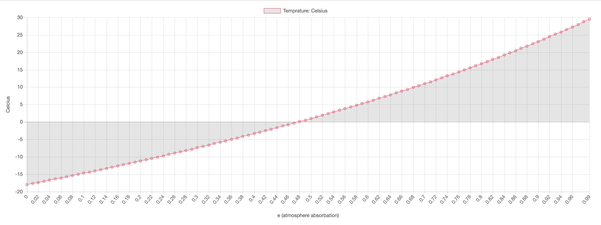

### [Simple Climate Model](http://climate-model.surge.sh/)

This is a simple climate model I made for my climate science class. Here is what the graph looks like:



## Usage
To run this project, download it and change directories into it. Then install the dependencies (`$ npm i`) and run it with webpack (`$ webpack`).

## Formula
The formula I am using is


The variables I used are:
- `A = 0.3` - I am not quite sure why `A` is `0.3`, but I think it has something to do with the atmosphere.

- `σ = 5.67 x 10^−8`
  > σ is known as the Stefan-Boltzmann constant, and has the value σ=5.67 x 10−8(Wm−2K −4)σ=5.67 x 10−8(Wm−2K −4);

- `S = 1370` - `S` is our solar constant and it is currently `1370`. A solar constant is the amount of radiation given off by the sun. Over a long period of time this may change, but for this model we can assume that it will stay at `1370`. `S` is expressed in `W / m2` or Watt per square meter.

- `ε` is the input. It is the atmospheric emissivity, or more simply current greenhouse effect.
  >a measure of the efficiency of the atmosphere's absorption of any infrared radiation (IR) incident upon it

  - If `ε` is `0` that is the equivalent of no greenhouse effect.
  - In our current atmosphere we have greenhouse effect of about `0.77`.

I then broke up the equation into two parts, the top and the bottom:

```
top = (1 - A) × S

bottom = (4 × σ × (1 - ε/2))
```

Finally I divided them and raised the result to `0.25`:

```
final = (top/bottom)^.25
```

When I checked this against the provided data it gave me the "correct" output so I will assume that the equation worked.

## Steps needed to get to this equation
1. This equation for incoming and outgoing radiation at the top of the atmosphere is:
<pre><code>S⋅(1 - A)/4 =
σ⋅ε⋅T<sub>e</sub><sup>4</sup> +
(1 - ε)⋅σ⋅T<sub>s</sub><sup>4</sup>
</code></pre>

2. The equation for incoming and outgoing radiation from the atmospheric layer is:
<pre><code>σ⋅ε⋅T<sub>s</sub><sup>4</sup>=
2⋅σ⋅ε⋅T<sub>e</sub><sup>4</sup>
</code></pre>

3. The equation for incoming and outgoing radiation at the surface is:
<pre><code>S⋅(1 − A)⋅4 +
σ⋅ε⋅T<sub>e</sub><sup>4</sup> =
σ⋅T<sub>s</sub><sup>4</sup>
</code></pre>

4. After solving the system of equations for T<sub>s</sub> and T<sub>e</sub> and then simplifying we get the above formula that is used to calculate the temperature of earth.


**NOTE** due to formatting issues, please treat T<sub>x</sub><sup>4</sup> as the variable `T` sub `x` to the power of `4`.

## Credit

[this](https://www.e-education.psu.edu/meteo469/node/198) amazing website is where almost all the content on this page came from.
